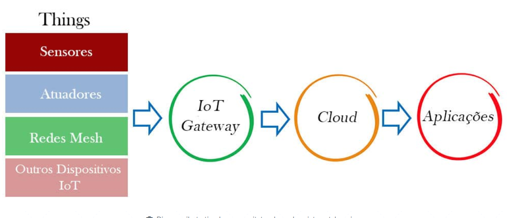

# Conceitos de Internet das Coisas
Internet das Coisas é a interconexão de dispositivos físicos à internet, permitindo que eles coletem, compartilhem e atuem com base em dados.

## Principais Elementos
### Arquitetura
A troca de informações entre os dispositivos em uma rede IoT é feita por meio de uma arquitetura distribuída que é composta por vários elementos.  
Os protocolos utilizados mais comuns são:
- Protocolos de Transporte
    - Wi-fi
    - GSM
    - Bluetooth
- Protocolos de Comunicação de Dados
    - MQTT
    - HTTP

__Artuitetura IoT:__

- Things: Dispositivos conectados que podem:
    - Coletar dados do ambiente em que se encontram.
    - Realizar algum processamento.
    - Transmitir tais dados pela internet.
    - Estabelecer uma comunicação entre si e servidores
- Gateway: Aparelho que conecta e gerencia comunicação, posicionado próximo aos dispositivos IoT.
- Cloud: Aplicação baseada na Núvem (AWS, Azure, etc..)
- Aplicações: Servidores

Os dispositivos podem estar conectados entre si e com o gateway edge através de diversas topologias de rede.
- Estrela: Dispositivos se conectam diretamente ao gateway edge, que atua como central de comunicação.
- Malha (Mesh): Dispositivos se conectam entre si e ao gateway edge, formando uma rede onde cada dispositivo pode retransmitir dados para outros dispositivos.
- Barramento (Bus): Todos estão conectados a um único cabo de comunicação, e o gateway edge é o ponto final da linha.
- Anel: Dispositivos são conectados em um loop fechado, e o gateway edge está em um ponto final do anel.

### Hardware
- Placa de Circuito baseado em um Microcontrolador (Ex: Arduino)
Objetivos:
    - Controlar outros dispositivos
    - Servir como hub intermediário
    - Coletar dados por meio de sensores
    - Realizar cálculos simples que não exigem muita memória
- Computador completo com Sistema Operacinonal
    - Raspberry Pi

### Sensores
Há diversos sensores disponíveis no mercado:
- De movimento
- De deslocamento indutivo
- De nível
- De intensidade luminosa
- Sensíveis à cor

Parametros a serem considerados:
- Custo
- Alcance
- Precisão
- Calibragem

_Não existe IoT sem sensores e aquisição de dados._

### Protocolo MQTT
__Conceito__  
Message Queuing Telemetry Transport (Transporte de Telemetria de Enfileiramento de Mensagens)
Criado em 1999 pela IBM especificamente para:
- Suportar comunicação M2M (Machine to Machine)
- Implementar uma arquitetura cliente-servidor orientada a mensagens

__Comunicação e Funcionamento__
- Publish: Dispositivos ou aplicações enviam mensagens para um "tópico" específico.
- Subscribe: Dispositivos ou aplicações se inscrevem em tópicos para receber mensagens publicadas nesse tópico.

- Tópicos: São estruturas hierárquicas, por exemplo (casa/sala/luz) que permitem que mensagens sejam categorizadas e direcionadas de forma eficiente.

- Broker MQTT: Servidor que gerencia a comunicação entre publicadores e assinantes. Ele recebe as mensagens e as filtra por tópicos, encaminhando para os assinantes correspondentes.

- Qualidade de Serviço (QoS):
    - QoS 0: A mensagem é entregue no máximo uma vez, sem garantias de entrega.
    - QoS 1: A mensagem é entregue pelo menos uma vez, com garantias de que será recebida, mas com possíveis duplicatas.
    - QoS 2: A mensagem é entregue exatamente uma vez, garantindo que não haverá duplicatas.

_MQTT é projetado para manter conexões persistentes, uma conexão pode ser reestabelecida automaticamente após uma desconexão. O protocolo inclui um mecanismo de "Keep Alive" para verificar se a conexão entre o cliente e broker está ativa._

## Requisitos
Segundo as metodologias modernas de desenvolvimento de software, os requisitos de um sistema se dividem em vários tipos de requerimentos: 
- De negócio
- De sistema
- De desempenho
- Funcionais
- Não funcionais

Os sistemas IoT exigem requisições adicionais devido a natureza intensa do tráfego de dados.  
Existem, portanto, requerimentos de gerenciamentos de dados que especificam como eles devem ser recebidos e tratados. 

### Requisitos não Funcionais
- __Disponibilidade__  
É preciso especificar o tempo de atividade do serviço. A maioria dos sistemas de IoT funciona 24 horas por dia e 7 dias por semana.
- __Confiabilidade__  
O projetista especifica o tempo de execução que o sistema deve apresentar sem incorrer em falhas ou erros. As IoT são aplicações críticas e não admitem falhas, sob pena de haver a geração de falsos alarmes.
- __Recuperação de Desastre__  
_Exemplo: Um terremoto em um dos datacenters que servem um sistema ou outro sistema de monitoramento meteorológico que utilize um datacenter na cidade A. Em caso de falha nessa localidade, os serviços devem migrar rapidamente para a cidade B, que é geograficamente distante._
- __Segurança, proteção de dados e backup__
Autenticação e Autorização de usuários.  
Proteção de dados coletados.
Regras e recursos a criar redundância de dados.
- __Escalabilidade__  
Suportar adoção rápida de novos dispositivos
Permitir upgrades automáticos nos recursos computacionais em núvem para atender aos picos de demanda.  
_Load Balancing é uma técnica comum_

### Arquiteturas de Referência para IoT
Há diversas plataformas, mas as três maiores em circulação são:
- Amazon AWS IoT
- Microsoft Azure IoT Suite
- Google Cloud IoT
